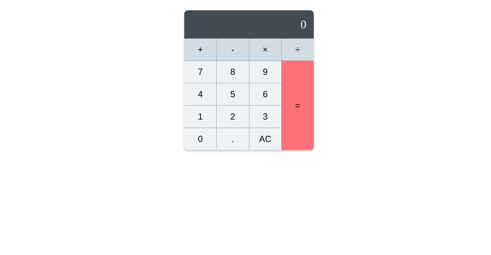

# Simple Calculator

This is a basic calculator application built using HTML, CSS, and JavaScript. It allows users to perform basic arithmetic operations such as addition, subtraction, multiplication, and division.

## Features

- Addition
- Subtraction
- Multiplication
- Division

## Screenshots

## Usage

1. Enter numbers using the number buttons.
2. Select the operation (+, -, \*, /) you want to perform.
3. Press the "=" button to see the result.

## Live Demo

Check out the live link [js-calculator](https://js-calculator-1stm.vercel.app/)

## Technologies Used

- HTML
- CSS
- JavaScript

## Contributing

If you'd like to contribute to this project, please fork the repository and create a pull request. Feel free to suggest improvements or add new features.
